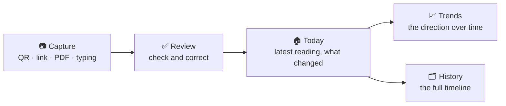

# Composition

**Scan the report. Keep the history. See the change.**

Your Tanita printout tells you what you measured today.
Composition tells you whether it's working.

A private body-composition tracker that lives in your browser — no account, no
subscription, no build step, no data leaving your device.

---

## The problem with a body-composition report

You step off the scale, the report prints, and it goes in a drawer. Next month you
get another one — and now you're holding two sheets of paper trying to remember
which number was which.

The number that matters isn't today's weight. It's the **direction** you're moving,
and whether your muscle is holding while your fat comes down. That only shows up
in a history, and a pile of paper is not a history.

Composition is that history.

---

## What you can do with it

| | |
|---|---|
| 📷 **Capture in seconds** | Scan the QR code on your report, paste the link, upload the PDF or photo, or type the numbers in. |
| ✅ **Check before you save** | Nothing is stored until you've seen it. Every field is editable, and anything the report didn't include stays blank — never invented. |
| 📈 **Watch the trend, not the number** | Every measure gets a chart. Zoom out to twelve months or the whole history at once. |
| 🧩 **See where the change happened** | Trunk, both arms and both legs, each with its own muscle, fat and fat percentage — so "I lost 2 kg" becomes "my legs lost fat and kept their muscle". |
| 🩺 **Catch the risks early** | Visceral fat, BMI, body water, metabolic age and BMR tracked alongside the rest, because body composition is more than weight. |
| ⚖️ **Read it your way** | Kilograms or pounds, light or dark, full motion or reduced. |
| 📤 **Take your data anywhere** | Export JSON, CSV, or a Samsung Health-shaped CSV for your own import workflow. |
| 📱 **Install it like an app** | Add it to your home screen and it opens full-screen. Works with no signal. |
| 🔒 **Keep it to yourself** | Readings live in your browser. No analytics, no telemetry, no tracking, no third party watching your health data. |

---

## Four screens, one job each

### 🏠 Today
The latest reading up front, with your change since last time, a live readout of the
lean-versus-fat split, and plain-language notes when something has actually moved —
*"Muscle mass is up 0.8 kg since your earliest reading."* No interpretation required.

### 📈 Trends
Measures are grouped into tabs — **Composition, Risk, Energy, Performance,
Segmental** — so related numbers sit together instead of in one long list.
Every measure gets its own card showing the latest value beside its **highest,
lowest and average** for the window you've chosen. Tap a card to chart it.

Pick how far back you're looking, and the chart adapts to it:

| Range | What you see |
|---|---|
| **7 days** | One point per day |
| **4 weeks** | One point per week, each a weekly average |
| **12 months** | One point per month, each a monthly average |
| **All years** | One point per year across your entire history |

### 🗂️ History
Every reading, newest first, with the full detail of each one a tap away. Correct a
mistake or delete a reading you didn't mean to save — it's your record.

### ⚙️ Settings
Units, theme, the optional cloud mirror, and your own export and backup tools.

---

## Built for the way you actually measure

**Your report, read exactly.** Point Composition at a Tanita report link and it reads
the same numbers the report page itself uses — not an estimate, not a re-typed
approximation. Every capture still lands on the review screen where you can see and
fix anything before it's kept.

**Honest about what's missing.** If your report doesn't include a measure, the app
shows *"Not recorded yet"* — it never fills a gap with a guess. For health data, a
wrong number is worse than no number.

**Empty space means empty space.** A week you didn't measure shows nothing rather
than a fake straight line. The chart only ever spans days you were actually on the
scale.

---

## Ready when you are — and when you're not

Open it once and it keeps working. Composition installs to your home screen and runs
offline: your history, your charts and your exports all work with no connection,
because nothing about them needs one.

There's no sign-up wall. No email required. No "free trial". Open it, scan a report,
and start the history.

---

## Optional: use it on more than one device

If you want the same readings on your phone and your laptop, sign in with Google and
turn on the cloud mirror. It works in both directions — Composition brings down what
the cloud has, keeps the newer version when a reading exists in both places, and
uploads anything local that's newer or missing.

It's **off by default**, and cloud rows belong to your signed-in account, protected by
Row Level Security. Leave it off and nothing ever leaves your device.

---

**Stop comparing today's number to last month's memory.**
**Start comparing it to last month's number.**

---

Building on it, running it yourself, or contributing? See
[CONTRIBUTING.md](CONTRIBUTING.md).
